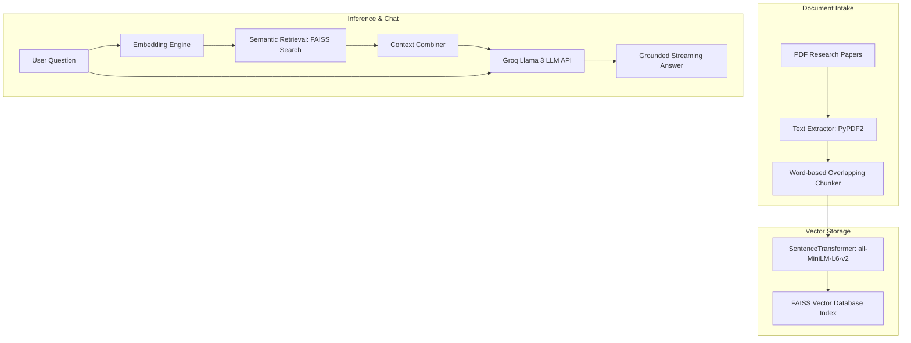

# 📚 PaperCompass — AI Research Paper Assistant

PaperCompass is a high-fidelity, premium AI-powered research assistant built using the RAG (Retrieval-Augmented Generation) pipeline. It allows researchers, students, and academics to upload multiple PDF research papers, construct a local semantic vector database, visualize collection analytics, and chat naturally with their documents.

---

## 🎨 Design Philosophy & User Experience
PaperCompass features an ultra-modern, **glassmorphic dark-mode workspace** using Space Slate gradients and neon highlights:
* **Outfit Typography:** Clean sans-serif lettering for scan-friendly readability.
* **Custom HTML Dashboard Cards:** Replaced traditional boxes with responsive, glowing statistics metrics showing message counts, chunks, and loaded pages.
* **Micro-interactions:** Hover transitions, active borders, and card translations to create an interactive experience.
* **Word-by-word Typing Streams:** ChatGPT-like real-time answer rendering.

---

## 🚀 Key Features

* **Upload Multiple PDFs:** Load papers locally or use built-in academic demo papers.
* **Semantic Retrieval Pipeline:** Converts PDF texts into dense semantic vector embeddings.
* **FAISS Indexing:** Leverages Facebook AI Similarity Search for instantaneous retrieval.
* **Conversational Chatbot:** Powered by Groq's high-speed Llama 3 LLM.
* **Grounded Citations:** Shows similarity scores, referenced source papers, and contextual snippets.
* **Export Conversations:** Download chat records as plaintext (`.txt`) or structured `.json`.
* **Collection Analytics:** Automatically computes word density, averages, and page distributions.

---

## 🏗️ Architecture & RAG Pipeline



---

## 📂 Project Directory Structure

```text
PaperCompass/
│
├── .streamlit/
│   └── config.toml         # Theme settings (Dark slate theme config)
│
├── components/
│   ├── chat.py             # Refactored Chat UI (statistics cards, history, inputs)
│   ├── dashboard.py        # Dashboard renderer (HTML paper cards & custom metrics)
│   └── sidebar.py          # Sidebar workspace (file uploads & build status)
│
├── styles/
│   └── style.css           # Premium glassmorphic Dark Mode stylesheets
│
├── uploads/                # Temporary local storage for uploaded PDFs
├── demo_papers/            # Sample research papers included in the repository
│
├── app.py                  # Main Streamlit application entrypoint
├── pdf_loader.py           # Handles PyPDF2 text & metadata extraction
├── chunker.py              # Word-based text segmentation
├── embeddings.py           # SentenceTransformers FAISS vector indexer
├── search.py               # Context semantic retriever
├── llm.py                  # Groq API client & prompt builder
├── utils.py                # Styling loaders & directory helpers
│
├── requirements.txt        # Package dependencies
└── README.md               # User documentation
```

---

## 🛠️ Installation & Setup

### Prerequisites
* Python 3.10 or higher
* Pip package manager
* Groq API Key (get one at [console.groq.com](https://console.groq.com/))

### Steps

1. **Clone the Repository:**
   ```bash
   git clone https://github.com/A-Rakin/papercompass.git
   cd papercompass
   ```

2. **Configure Environment Variables:**
   Create a `.env` file in the root directory and insert your Groq API Key:
   ```env
   GROQ_API_KEY=your_groq_api_key_here
   ```

3. **Install Dependencies:**
   ```bash
   pip install -r requirements.txt
   ```

4. **Launch the Application:**
   ```bash
   streamlit run app.py
   ```

---

## 📖 User Guide

1. Open `http://localhost:8501` in your browser.
2. In the left sidebar under **Choose Mode**:
   * Upload your own PDF documents, or
   * Select **Use Demo Papers** and click **Load Demo Papers** to load the preset academic articles.
3. Click the green **🚀 Build Knowledge Base** button.
4. Once completed, the **Dashboard Analytics** and the **💬 Chatbot** will automatically render.
5. Ask any questions about the methodologies, hyperparameters, or results, or click on the **Suggested Questions** to run instant RAG analysis!

---

## ⚙️ Dependencies
* **streamlit** - Web application framework
* **groq** - High-speed LLM inference
* **sentence-transformers** - Semantic vector model loader
* **faiss-cpu** - Dense vector similarity search index
* **PyPDF2** - PDF reading and parsing
* **python-dotenv** - App environment configuration

---

## 📄 License
This project is licensed under the MIT License.


